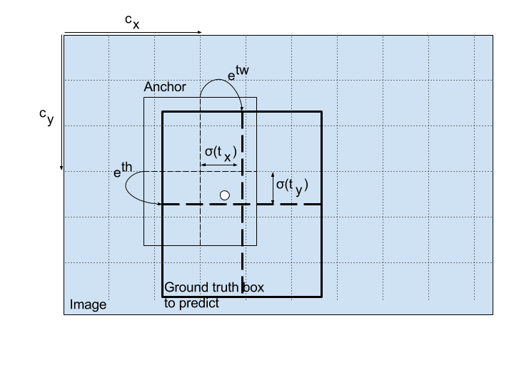

#Yolo

**References**: The ideas presented in this notebook came primarily from the two YOLO papers. The implementation here also took significant inspiration and used many components from Allan Zelener's GitHub repository. The pre-trained weights used in this exercise came from the official YOLO website. 
- Joseph Redmon, Santosh Divvala, Ross Girshick, Ali Farhadi - [You Only Look Once: Unified, Real-Time Object Detection](https://arxiv.org/abs/1506.02640) (2015)
- Joseph Redmon, Ali Farhadi - [YOLO9000: Better, Faster, Stronger](https://arxiv.org/abs/1612.08242) (2016)
- Allan Zelener - [YAD2K: Yet Another Darknet 2 Keras](https://github.com/allanzelener/YAD2K)
- The official YOLO website (https://pjreddie.com/darknet/yolo/) 

## 代码注释

以下来自 ：

https://github.com/YunYang1994/cv-notebooks/blob/master/ai_algorithm/YOLOv3.md

https://github.com/YunYang1994/tensorflow-yolov3

```python

def decode(conv_output, i=0):
    # 这里的 i=0、1 或者 2， 以分别对应三种网格尺度
    conv_shape       = tf.shape(conv_output)
    batch_size       = conv_shape[0]
    output_size      = conv_shape[1]

    conv_output = tf.reshape(conv_output, (batch_size, output_size, output_size, 3, 5 + NUM_CLASS))

    """
    有两点比较困惑：
    1.卷积后得到的FEATUREMAP最后一个维度有85，为什么包含 dxdy,dwdh,conf,prob 的信息？
    这是实验得到的？还是假设？
    2.
    """

    conv_raw_dxdy = conv_output[:, :, :, :, 0:2] # 中心位置的偏移量
    conv_raw_dwdh = conv_output[:, :, :, :, 2:4] # 预测框长宽的偏移量
    conv_raw_conf = conv_output[:, :, :, :, 4:5]
    conv_raw_prob = conv_output[:, :, :, :, 5: ]

    # 好了，接下来需要画网格了。其中，output_size 等于 13、26 或者 32
    y = tf.tile(tf.range(output_size, dtype=tf.int32)[:, tf.newaxis], [1, output_size])
    x = tf.tile(tf.range(output_size, dtype=tf.int32)[tf.newaxis, :], [output_size, 1])

    """
    tf.tile : tile 有·铺·的的意思，这里是复制
    tf.newaxis： 插入一个dim，相当于RESHAPE
    tf.cast： 就是类型转换
    """
    

    xy_grid = tf.concat([x[:, :, tf.newaxis], y[:, :, tf.newaxis]], axis=-1)
    xy_grid = tf.tile(xy_grid[tf.newaxis, :, :, tf.newaxis, :], [batch_size, 1, 1, 3, 1])
    xy_grid = tf.cast(xy_grid, tf.float32) # 计算网格左上角的位置
    # 根据上图公式计算预测框的中心位置
    pred_xy = (tf.sigmoid(conv_raw_dxdy) + xy_grid) * STRIDES[i] # 乘上缩放的倍数，如 8、16 和 32 倍。
    # 根据上图公式计算预测框的长和宽大小
    pred_wh = (tf.exp(conv_raw_dwdh) * ANCHORS[i]) * STRIDES[i]
    # 合并边界框的位置和长宽信息
    pred_xywh = tf.concat([pred_xy, pred_wh], axis=-1)

    pred_conf = tf.sigmoid(conv_raw_conf) # 计算预测框里object的置信度
    pred_prob = tf.sigmoid(conv_raw_prob) # 计算预测框里object的类别概率

    return tf.concat([pred_xywh, pred_conf, pred_prob], axis=-1)

```


```PYTHON
def yolo_boxes(pred, anchors, classes):
    # pred: (batch_size, grid, grid, anchors, (x, y, w, h, obj, ...classes))
    grid_size = tf.shape(pred)[1]
    box_xy, box_wh, objectness, class_probs = tf.split(
        pred, (2, 2, 1, classes), axis=-1)

    box_xy = tf.sigmoid(box_xy)
    objectness = tf.sigmoid(objectness)
    class_probs = tf.sigmoid(class_probs)
    pred_box = tf.concat((box_xy, box_wh), axis=-1)  # original xywh for loss

    # !!! grid[x][y] == (y, x)
    grid = tf.meshgrid(tf.range(grid_size), tf.range(grid_size))
    grid = tf.expand_dims(tf.stack(grid, axis=-1), axis=2)  # [gx, gy, 1, 2]

    box_xy = (box_xy + tf.cast(grid, tf.float32)) / \
        tf.cast(grid_size, tf.float32)
    box_wh = tf.exp(box_wh) * anchors

    box_x1y1 = box_xy - box_wh / 2
    box_x2y2 = box_xy + box_wh / 2
    bbox = tf.concat([box_x1y1, box_x2y2], axis=-1)

    return bbox, objectness, class_probs, pred_box
```

以下这个可能最好理解

```python
def yolo_head(feats, anchors, num_classes, input_shape, calc_loss=False):
    """Convert final layer features to bounding box parameters."""
    num_anchors = len(anchors)
    # Reshape to batch, height, width, num_anchors, box_params.
    anchors_tensor = K.reshape(K.constant(anchors), [1, 1, 1, num_anchors, 2])

    grid_shape = K.shape(feats)[1:3] # height, width
    grid_y = K.tile(K.reshape(K.arange(0, stop=grid_shape[0]), [-1, 1, 1, 1]),
        [1, grid_shape[1], 1, 1])
    grid_x = K.tile(K.reshape(K.arange(0, stop=grid_shape[1]), [1, -1, 1, 1]),
        [grid_shape[0], 1, 1, 1])
    grid = K.concatenate([grid_x, grid_y])
    grid = K.cast(grid, K.dtype(feats))

    feats = K.reshape(
        feats, [-1, grid_shape[0], grid_shape[1], num_anchors, num_classes + 5])

    # Adjust preditions to each spatial grid point and anchor size.
    box_xy = (K.sigmoid(feats[..., :2]) + grid) / K.cast(grid_shape[::-1], K.dtype(feats))
    box_wh = K.exp(feats[..., 2:4]) * anchors_tensor / K.cast(input_shape[::-1], K.dtype(feats))
    box_confidence = K.sigmoid(feats[..., 4:5])
    box_class_probs = K.sigmoid(feats[..., 5:])

    if calc_loss == True:
        return grid, feats, box_xy, box_wh
    return box_xy, box_wh, box_confidence, box_class_probs
```


### 预测BOX

[这篇文章的解释最详细](http://christopher5106.github.io/object/detectors/2017/08/10/bounding-box-object-detectors-understanding-yolo.html)

先看公式:

$$b_x = \sigma(t_x) + c_x$$
$$b_y = \sigma(t_y) + c_y$$
$$b_w = p_w \ e^{t_w}$$
$$b_h = p_h \ e^{t_h}$$

$b_x, b_y, b_w, b_h$ are the x,y `center co-ordinates`, width and height of our prediction.

$t_x, t_y, t_w, t_h$ is what the `network outputs`(卷积层的输出).

$c_x,c_y$ are the top-left co-ordinates of the grid.(注意图里的CX,CY 指示的指示坐标系)

$p_w,p_h$ are anchors dimensions for the box



### 结论

简单点说：

- YOLO就是把图片输入到`卷积网络（DARKNET）`中，得到一个由$n \times n$`cell(准确的应该成为神经节点)`组成 的featuremap
- featuremap `shape(bath_size,n,n,channels)`
这里的$channels = Box数量*(4个形状参数+1个可信度+class数量)$ 也就是说卷积的输出要恰好满足这个
- cell`shape(1,1,channels)`
- 形象点说，把每个CELL放入 $n \times n$的网格中，$c_x,c_y$就是这个左上角坐标
- 把CELL分成几个部分:
    $t_x, t_y, t_w, t_h = cell[...,0:4],confidence=cell[..., 4:5],class=cell[..., 5:]$

```python
box_xy = (K.sigmoid(feats[..., :2]) + grid) / K.cast(grid_shape[::-1], K.dtyp(feats))
box_wh = K.exp(feats[..., 2:4]) * anchors_tensor / K.cast(input_shape[::-1],K.dtype(feats))
box_confidence = K.sigmoid(feats[..., 4:5])
box_class_probs = K.sigmoid(feats[..., 5:])
```

### 卷积的特性

> The convolutions enable to compute predictions at different positions in an image in an optimized way. This avoids using a sliding window to compute separately a prediction at every potential position.

使用卷积计算预测的好处是 `结果和位置无关`

> For every `positive position`, the network predicts a `regression` on the bounding box precise position and dimension.

> In the second version of Yolo, these predictions are relative to the grid position and anchor size (instead of the full image) as in the Faster-RCNN models for better performance

http://christopher5106.github.io/object/detectors/2017/08/10/bounding-box-object-detectors-understanding-yolo.html


https://blog.paperspace.com/how-to-implement-a-yolo-object-detector-in-pytorch/
